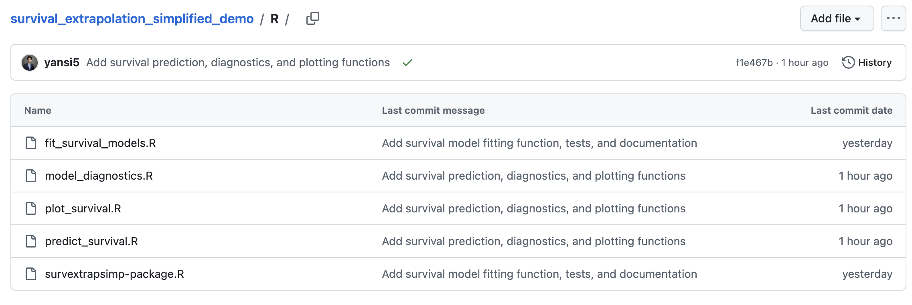
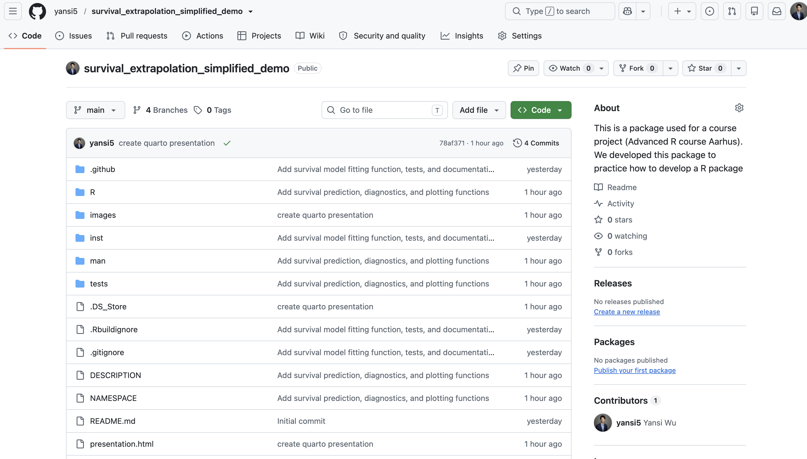

```{r}
#| include: false

devtools::load_all()
```

## Motivation

Parametric survival extrapolation is commonly used when observed survival data do not cover the full time horizon required for an analysis, e.g., cost-effectiveness analysis.

**Core steps:**

-   Fit alternative parametric survival distributions
-   Compare statistical model fit
-   Predict survival beyond the observed follow-up
-   Visualize observed and extrapolated survival curves

**Aim:** Turn our survival extrapolation workflow into a simple, reusable, open-sourced R package.

## Research context

This project was developed within **Decision Analysis in R for Technologies in Health (DARTH)**. \
**Github:** <https://github.com/DARTH-git>

DARTH promotes transparent and reproducible decision-analytic modelling in R, including:

-   reusable code
-   formal validation
-   transparent documentation
-   version control with Git and GitHub
-   tutorial paper for implementation

## Example R packages and models

{fig-align="center" width="72%"}

::: {style="font-size: 0.60em; line-height: 1.35;"}
**Examples:**\
**Interactive Decision Tree Model (OpenTree)** — Hawre Jalal, Harvard Medical School\
**Cohort State-Transition Markov Model** — Fernando Alarid-Escudero, Stanford Medical School\
**Microsimulation Model** — Eline Krijkamp, Erasmus University\
**dampack** and **darthpack** — Fernando Alarid-Escudero, Stanford Medical School
:::

## What the package does

| Function                | Purpose                                          |
|-------------------------|-----------------------------------------------|
| `fit_survival_models()` | Fit parametric survival models by treatment arm  |
| `model_diagnostics()`   | Compare models using AIC and BIC                 |
| `predict_survival()`    | Predict extrapolated survival probabilities      |
| `plot_survival()`       | Plot Kaplan-Meier and parametric survival curves |

## Package development workflow

::: {style="font-size: 0.68em; line-height: 1.15;"}
The package was developed iteratively using the standard R package workflow:

**Write function (pre-developed & validated)**\
↓\
**Informally test the function**\
↓\
**Create formal tests with `testthat`**\
↓\
**Document with `roxygen2`**\
↓\
**Run `devtools::document()`**\
↓\
**Run `devtools::check()`**\
↓\
**Commit, branch, merge, and push with Git/GitHub**
:::

## Example data

Use the `lung` dataset from the `survival` package.

```{r}
lung_data <- data.frame(
  time = survival::lung$time,
  status = survival::lung$status - 1,
  treat = survival::lung$sex
)

head(lung_data)
```

The package takes three variables:

-   `time`: observed survival time
-   `status`: 0 = censored, 1 = event
-   `treat`: treatment/group identifier

## Fitting and comparing survival models

```{r}
fits <- fit_survival_models(
  data = lung_data,
  dists_to_fit = c("weibull", "lnorm"),
  arm_names = c(
    "1" = "Treatment 1",
    "2" = "Treatment 2"
  )
)

model_diagnostics(fits)
```

`fit_survival_models()` fits each requested parametric distribution separately for each treatment arm.

`model_diagnostics()` compares the fitted models using AIC and BIC.

## Survival extrapolation

```{r}
#| fig-width: 9
#| fig-height: 5

plot_survival(
  fits,
  data = lung_data,
  times = seq(0, 1500, by = 10)
)
```

`predict_survival()` predicts and extends parametric curves beyond the observed follow-up period.

`plot_survival()` plots observed Kaplan-Meier (black) and parametric survival curves (colored).

## Formal testing

Each function has a corresponding unit test using `testthat`.

{fig-align="center" width="100%"}

## Devtools testing

Functions were documented using `devtools::test()`.

```{r}
devtools::test()
```

## Documentation and package checking

Functions were documented using `roxygen2`.

```{r}
#| eval: false

devtools::document()
```

This generates the help files and updates the package `NAMESPACE`.

The complete package was then checked using `devtools::test()`.

```{r}
#| eval: false

devtools::check()
```

The package passed with:

-   0 errors
-   0 warnings
-   1 environment-related note: unable to verify current time

## Final R package

{fig-align="center"}

## Next steps

The current version deliberately focuses on a simple core workflow for this course

However, our R packge includes:

-   additional survival-model diagnostics (e.g., HR)
-   flexible parametric and spline models
-   background mortality adjustment
-   probabilistic analysis
-   more customizable plotting

**DARTH GitHub:** <https://github.com/DARTH-git>
